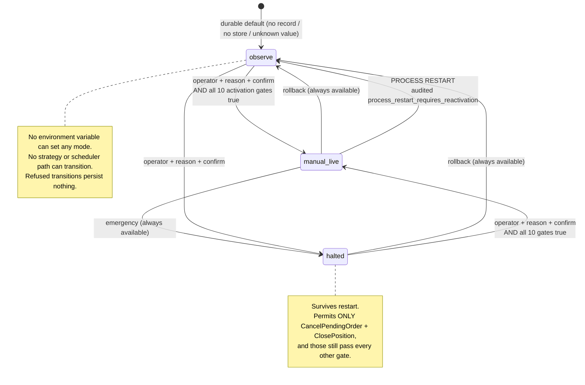
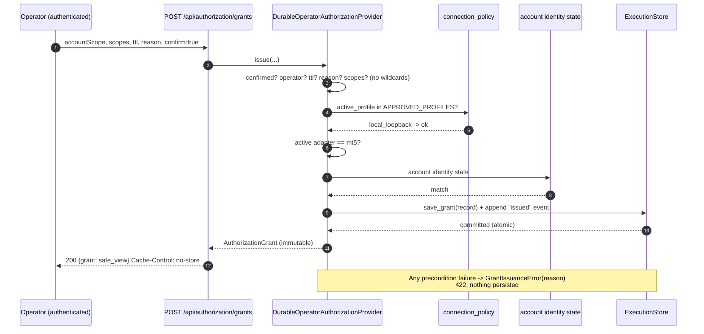
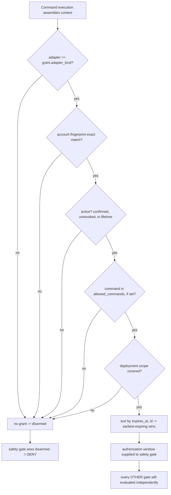
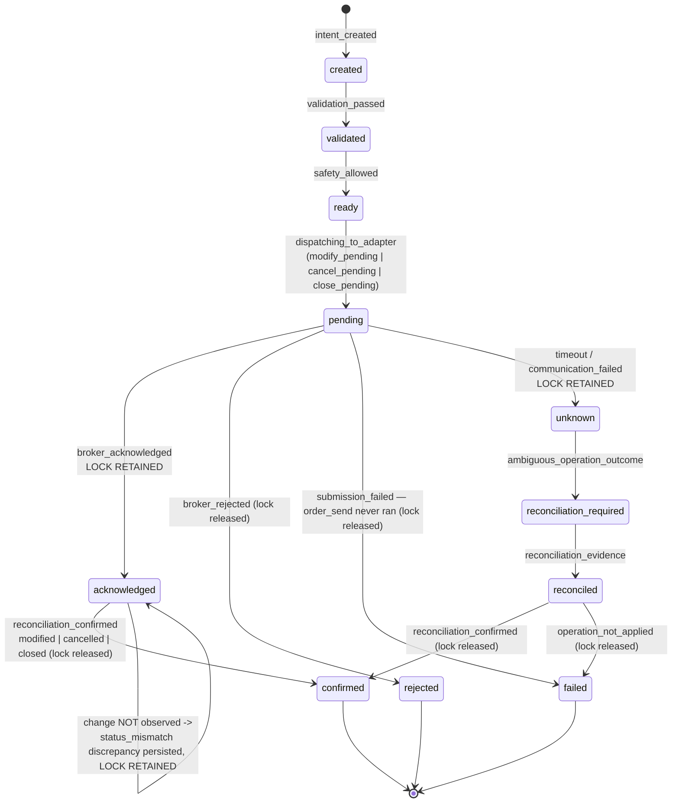
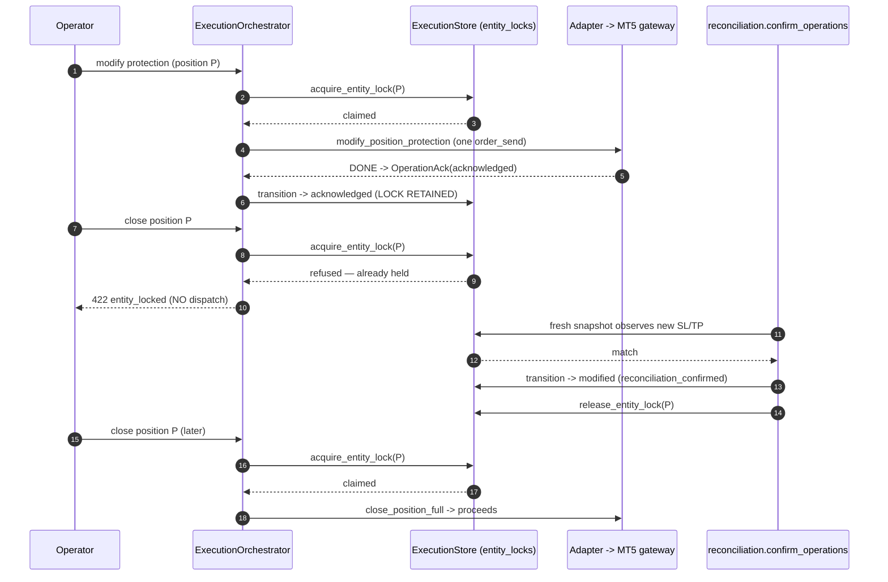
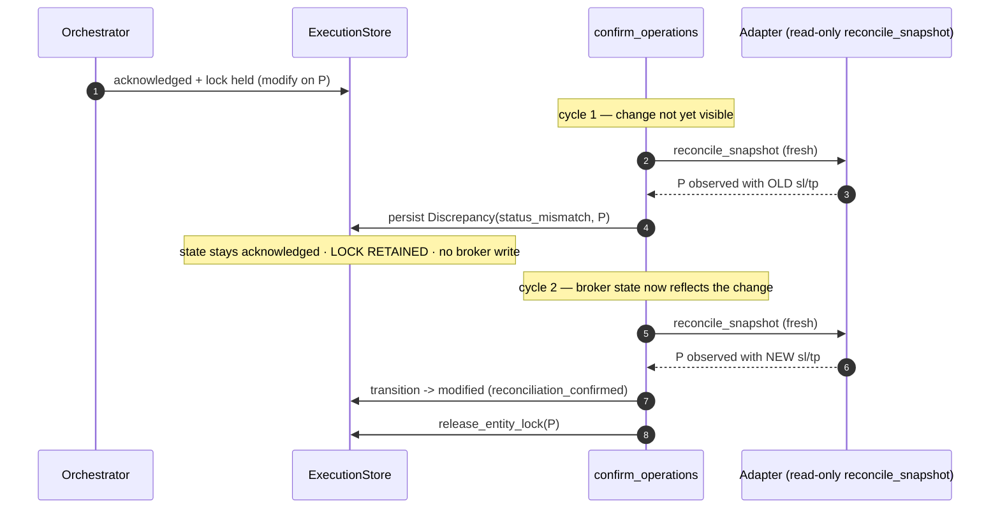

# LIVE-3 Architecture Checkpoint: Controlled Manual Execution

> **Canonical reference for the post-LIVE-3 production architecture.**
> Every claim below was verified against production code at the commit named in §1 —
> not copied from planning documents or slice reports. Where a slice report and the
> code disagreed, the code wins and the difference is recorded in §17.
>
> `CONTROL-TOWER-ARCHITECTURE-V1.md` (ADR-LIVE-3) records the *decision*.
> This document records the *state*. It does not restate the ADR.

---

## 1. Scope and status

**Checkpoint:** branch `live-implementation-prep`, commit `50c3fb3` — *LIVE-3: Add controlled position and order management*.

**LIVE-3 introduced:**

- a **durable** operator authorization provider (scoped, immutable, revocable grants) replacing mock-only authorization for the live path;
- **execution-mode governance** with one durable owner (`observe` / `manual_live` / `halted`);
- three additional executable operations — modify position protection, cancel pending order, close position (full) — joining LIVE-2's market-order submission;
- **reconciliation-confirmed** lifecycle completion (a broker acknowledgement is no longer terminal);
- **durable entity locking** (one in-flight mutation per broker entity);
- idempotency **payload-conflict** detection;
- a minimal manual UI surface and governance telemetry.

**LIVE-3 deliberately did not introduce:** autonomous or strategy-triggered execution; pending / limit / stop / stop-limit order creation; risk-increasing protection changes; stop removal; partial close; bulk or flatten operations; remote profile activation; unattended trading; any generic broker-mutation payload or endpoint.

---

## 2. Architectural invariants

These are non-negotiable. Each is enforced by the owner named in §3 and pinned by the test named in §16.

| # | Invariant |
|---|---|
| I-1 | **Exactly four executable operations** exist: `SubmitMarketOrder`, `ModifyPositionProtection`, `CancelPendingOrder`, `ClosePosition`. |
| I-2 | **One canonical command pipeline.** Every mutation flows through `ExecutionOrchestrator.execute`; there is no alternate execution route. |
| I-3 | **No generic broker payload.** Each operation has its own immutable, construction-validated request type. No endpoint accepts an arbitrary broker action. |
| I-4 | **No strategy-triggered execution.** No strategy or scheduler code path can execute, arm, or change execution mode. |
| I-5 | **No remote live execution** under current prerequisites — `local_loopback` remains the only approved connection profile. |
| I-6 | **`observe` is the durable default** for the governed mode. |
| I-7 | **Restart cannot preserve or fabricate live activation.** A persisted `manual_live` is downgraded to `observe` with an audited transition on the first read in a new process. |
| I-8 | **Acknowledgement is not confirmation.** Terminal `modified` / `cancelled` / `closed` is recorded only by reconciliation observing the change. |
| I-9 | **One in-flight mutation per broker entity**, enforced by a durable lock claimed before dispatch. |
| I-10 | **Ambiguity freezes the entity.** A timeout or communication failure retains the lock and routes to `reconciliation_required`. |
| I-11 | **Reconciliation never issues a corrective broker write.** It touches the store only. |
| I-12 | **Every live mutation remains gated and fail-closed** — a fault, unknown state, missing state, or stale state denies. |

---

## 3. Ownership map

Exact files, classes and functions. "Forbidden alternate paths" names what must *not* be used for new execution work.

| Concern | Canonical owner | Supporting collaborators | Persisted state | Forbidden alternate paths / non-owners |
|---|---|---|---|---|
| Command catalogue | `command_registry.py` — `REGISTRY`, `CommandSpec`, `execution_command_names()`, `is_halted_available()` | `command_channel` (read-only vocabulary), `execution_safety` (risk constants) | — | No module re-declares a command list; all vocabularies derive from here |
| Authorization (live) | `command_authorization.DurableOperatorAuthorizationProvider` — `issue()`, `revoke()`, `applicable_grant()` | `AuthorizationGrant` (immutable), `execution_store` | `auth_grants`, `auth_grant_events` | `MockAuthorizationProvider` — fixture/tests only; refuses every non-mock adapter |
| Authorization (fixture) | `command_authorization.MockAuthorizationProvider.current_grant()` | — | none (synthetic) | Must never authorize a non-mock adapter |
| Execution mode | `execution_mode.ExecutionModeOwner` — `current_mode()`, `transition()` | `execution_store`, `server._manual_live_gates()` | `mode_transitions` (append-only) | No env var; no strategy/scheduler path; `execution_safety` owns mode *semantics*, not mode *state* |
| Command validation | `execution.py` validators — `v_market_order_payload`, `v_position_protection`, `v_cancel_order`, `v_close_position`, `v_broker_connected`, `v_capability`, `v_approved_connection_profile` | `COMMAND_SPEC`, `ExecutionEnv.broker_snapshot` | — | No route-local validation |
| Safety policy | `execution_safety.evaluate()` (pure, deny-by-default, never raises) | `SafetyContext`, `command_registry.is_halted_available` | — | Not injectable — the orchestrator calls it directly so it cannot be swapped |
| Execution context | `server._execution_context()` → `execution_context.ExecutionContext` | `_node_facts()`, `_account_identity_state()`, `_EXECUTION_MODE`, `_DURABLE_AUTHORIZATION` | — | Assembled once per command; nothing downstream reconstructs safety state |
| Orchestration | `execution.ExecutionOrchestrator.execute()` | `_begin_intent`, `_market_order_lifecycle`, `_operation_lifecycle` | — | The single pipeline (I-2) |
| Dispatch (runtime seam) | `server._dispatch_command` → `server._apply_command_effects` | `_broker_context()` | — | Constructs the canonical request; never a raw broker payload |
| Broker adapters | `broker.MockBroker`, `broker.MT5Adapter` — `submit_market_order`, `modify_position_protection`, `cancel_pending_order`, `close_position` | `broker_adapter.BrokerAdapter` (ABC, inert defaults) | — | `submit_command` / `cancel_order` / `modify_order` / `flatten` are legacy fixture verbs, **inert on MT5** |
| Typed MT5 gateway | `live/mt5_gateway.MT5Gateway` — `open_position`, `modify_position_protection`, `cancel_pending_order`, `close_position_full` | injectable `sdk` | — | **`modify_position_sl` and `close_position` are legacy node-side loose methods** used only by `live/executor.py` — see §14 |
| Result classification | `live/mt5_results` — `classify()` (submit), `classify_action()` (modify/cancel/close), `MT5SubmitResult`, `MT5ActionResult` | `build_retcode_map`, `extract_evidence` | — | No raw retcode leaves the adapter |
| Canonical models | `broker_adapter.py` — `MarketOrderRequest`, `ModifyPositionProtectionRequest`, `CancelPendingOrderRequest`, `ClosePositionRequest`, `MarketOrderAck`, `OperationAck` | — | — | All frozen + validated in `__post_init__` |
| Lifecycle state machine | `order_lifecycle.py` — `ALLOWED_TRANSITIONS`, `transition()`, `recovery_plan()` | — | — | Only `transition()` may move an intent |
| Lifecycle persistence | `execution_store.ExecutionStore` — `create_intent`, `record_transition` | `security_config.redact_mapping` | `intents`, `intent_transitions` (append-only) | No delete/update surface on history |
| Idempotency | `ExecutionOrchestrator.execute` (replay + conflict) + `ExecutionStore.intent_by_idempotency_key` | `security_config.redact_mapping` | `intents.idempotency_key`, `metadata_json` | — |
| Entity locks | `ExecutionStore.acquire_entity_lock` / `release_entity_lock` / `active_entity_locks` | `execution.ENTITY_REF_KEY` | `entity_locks` (PK `entity_ref`) | Never expiry-based release |
| Reconciliation | `reconciliation.py` — `run_reconciliation()`, `confirm_operations()`, `safety_posture()` | `execution_store`, adapter `reconcile_snapshot` | `recon_runs`, `recon_items` | **Zero broker calls** — no `get_broker`, no `order_send` (verified) |
| Telemetry | `server._governance_telemetry()`, `server._market_order_telemetry()`, `execution_telemetry.build()` | `execution_store` | — | Derived only; no independently mutable telemetry |
| API | `server.py` — `_run_entity_operation()` + the three operation routes, grant routes, mode routes | `auth_policy.classify_route` (deny-by-default) | — | `/api/commands/{name}` cannot invoke any of the four (§4) |
| UI | `frontend/src/components/domain/ManualExecutionPanel.tsx`, `MarketOrderPanel.tsx` | `lib/api.ts` (`entityOperation`, `idempotencyKey()`) | none (memory only) | No browser storage of any kind |

---

## 4. Canonical execution pipeline

Ordered path for the three entity operations (`_run_entity_operation`); market-order submission is identical except that it has no entity reference and therefore no lock.

```
HTTP POST /api/execution/{positions|orders}/{reference}/{protection|cancel|close}
 1. Operator authentication            auth_policy — route classified "protected", deny-by-default
 2. Request parsing                    _run_entity_operation; reference injected as positionRef/orderRef
 3. Idempotency-Key header             REQUIRED  -> 422 idempotency_key_required
 4. confirm: true                      REQUIRED  -> 422 confirmation_required
 5. Confirmation threading             _CONFIRMED_CTX contextvar set for this request only
 6. ─ ExecutionOrchestrator.execute ───────────────────────────────────────────
 7.   Idempotency lookup               intent_by_idempotency_key (durable, pre-validation)
        · same key + same payload  -> REPLAY the durable outcome, zero broker calls
        · same key + changed payload -> DENY idempotency_conflict
 8.   Validate                         registry membership; then per-command validators:
                                         · fresh broker snapshot (<=120s) or stale_broker_snapshot
                                         · entity present in that snapshot
                                         · non-risk-increasing protection rules
                                         · broker connected; required capability; approved profile
 9.   Safety                           execution_safety.evaluate() over the ONE assembled context:
                                         mode -> duplicate -> identity -> confirmation -> node health
                                         -> account identity -> reconciliation -> authorization window
10.   Resolve                          per-command feasibility (explicit "no additional constraint")
11.   Durability gate                  execution store REQUIRED; intent created (created -> validated)
12.   Entity discrepancy gate          unresolved same-entity items -> DENY entity_discrepancy_unresolved
13.   Entity lock claim                atomic; already held -> DENY entity_locked
14.   Lifecycle                        ready(safety_allowed) -> {modify|cancel|close}_pending
15.   Dispatch                         adapter -> typed gateway -> exactly one order_send
16.   Acknowledgement classification   MT5ActionResult -> canonical OperationAck
17.   Lifecycle persistence            see §8; lock retained or released per outcome
18. ─ Audit event appended ────────────────────────────────────────────────────
19. Reconciliation (later cycle)       confirm_operations() over a fresh snapshot
20. Terminal outcome                   modified | cancelled | closed  + lock released
                                       or persisted discrepancy      + lock retained
```

**Outcome classes — deliberately distinct:**

| Class | Reached at | Dispatch occurred | Lifecycle state | Lock |
|---|---|---|---|---|
| Denied before dispatch | steps 3–13 | **No** | `failed` (if an intent was created) or none | released / never held |
| Known broker rejection | 16 | Yes | `rejected` | released |
| Acknowledged, not confirmed | 17 | Yes | `acknowledged` | **retained** |
| Ambiguous / unknown | 17 | Yes (outcome unknowable) | `unknown` → `reconciliation_required` | **retained** |
| Submission failed | 17 | No (`order_send` never ran) | `failed` | released |
| Confirmed terminal | 19–20 | — | `modified` / `cancelled` / `closed` | released |

---

## 5. Execution-mode state machine

**Owner:** `execution_mode.ExecutionModeOwner` over the append-only `mode_transitions` table. The mode is a *derived read* of that log — there is no in-memory truth and no second store.

| Mode | Entry rules | Permitted commands | Restart behaviour |
|---|---|---|---|
| `observe` | Default (no record, no store, or unknown persisted value → `observe`). Always reachable. | none (all mutations deny `execution_mode_not_active`) | survives |
| `manual_live` | Operator + reason + `confirm:true` **and every** activation gate true (see below) | all four, subject to every other gate | **downgraded to `observe`** with an audited `process_restart_requires_reactivation` transition |
| `halted` | Operator + reason + `confirm:true`. Always reachable. | `CancelPendingOrder`, `ClosePosition` only (registry `halted_available`); all others deny `execution_halted` | survives (staying halted is safe) |

**Activation gates for `manual_live`** (`server._manual_live_gates()`, all must be true):
`operatorAuthenticated`, `approvedConnectionProfile`, `adapterIsMt5`, `adapterWriteCapable`, `adapterConnected`, `accountIdentityMatch`, `nodeTelemetryFresh`, `reconciliationClean`, `validScopedGrant`, `executionStoreAvailable`.

Every transition persists `from_mode`, `to_mode`, `at`, `operator_ref`, `reason` and — for `manual_live` — the full gate evidence JSON. A transition without a reason, operator or confirmation is refused and **records nothing**.



### 5.1 Scope of mode governance — mock versus live

This distinction is load-bearing and easy to misread:

- **Live path** (`CONTROL_TOWER_BROKER_ADAPTER=mt5`): `server._execution_context()` sets `execution_mode` from `ExecutionModeOwner.current_mode()` and `authorization` from the durable provider. Provenance is `tower: durable-governance`. Shipped state = `observe`, no grant → **all four operations deny**.
- **Mock/fixture path** (shipped default, adapter unset → `mock`): the context is explicitly synthetic — provenance `tower: mock-authorization`, `node: mock-synthetic`, `broker: mock-fixture` — with `execution_mode = active` and a mock grant, so the fixture control plane keeps working. `ExecutionModeOwner` still reports `observe` and is still exposed at `/api/execution/mode`, but the mock context does not consume it.

**Governed mode gates the live adapter path. The mock fixture world remains deliberately permissive and is labelled as synthetic in every surface.** See §17 for why this is recorded here.

---

## 6. Authorization flow

**Owner:** `DurableOperatorAuthorizationProvider`. Grants are immutable rows in `auth_grants` with an append-only `auth_grant_events` history (`issued`, `revoked`).

**Grant fields:** `authorization_id`, `operator_ref`, `issued_at`, `expires_at`, `allowed_risk_classes`, `allowed_scopes` (deployment), `account_scope` (**exact** account fingerprint), `allowed_commands` (optional exact set; `None` = by risk class), `max_quantity` (optional), `confirmed`, `revoked`, `reason`, `provider`, `adapter_kind`. **No credential or secret is ever stored.**

**Issuance preconditions** — each denies with a machine reason, and nothing is written:
`confirmation_required`, `operator_identity_required`, `connection_profile_not_approved`, `adapter_not_grantable` (adapter ≠ mt5), `account_identity_not_verified` (state ≠ match), `account_scope_required` (blank **or `*` — no live wildcard**), `deployment_scope_required` (empty **or `*`**), `risk_class_required`, `invalid_ttl` (must be `0 < ttl ≤ 8h`), `reason_required`, `execution_store_unavailable`.

**Selection** (`applicable_grant`) is deterministic and deny-by-default: candidates must be active (confirmed, unrevoked, inside lifetime), **adapter-exact**, **account-exact**, scope-covering and command-covering; the survivors are sorted by `(expires_at, authorization_id)` and the **earliest-expiring** wins. Malformed rows are skipped and never authorize. Expiry and revocation both remove a grant from selection immediately.

> **A valid grant never overrides another failed gate.** It contributes exactly one fact — the tower-side authorization window. Node health, node arming, account identity, broker connection, execution mode, reconciliation posture, ConnectionPolicy and execution-store health are evaluated independently, and any one of them denies on its own.





---

## 7. Operation matrix

| | `SubmitMarketOrder` | `ModifyPositionProtection` | `CancelPendingOrder` | `ClosePosition` |
|---|---|---|---|---|
| Target entity | none (creates one) | open position | pending order | open position |
| Allowed modes | `manual_live` | `manual_live` | `manual_live`, `halted` | `manual_live`, `halted` |
| Principal validators | `v_market_order_payload`, `v_broker_connected`, `v_capability(supportsMarketExecution)`, `v_approved_connection_profile` | `v_position_protection`, `v_broker_connected`, `v_capability(supportsModify)`, `v_approved_connection_profile` | `v_cancel_order`, `v_broker_connected`, `v_capability(supportsCancelOrder)`, `v_approved_connection_profile` | `v_close_position`, `v_broker_connected`, `v_capability(supportsClosePosition)`, `v_approved_connection_profile` |
| Entity-lock key | — (no lock) | `positionRef` | `orderRef` | `positionRef` |
| Typed gateway method | `open_position` | `modify_position_protection` (`TRADE_ACTION_SLTP`) | `cancel_pending_order` (`TRADE_ACTION_REMOVE`) | `close_position_full` (`TRADE_ACTION_DEAL`, observed volume) |
| Acknowledgement state | `filled` / `partially_filled` (`MarketOrderAck`) | `acknowledged` (`OperationAck`) | `acknowledged` | `acknowledged` |
| Reconciliation evidence required | none — fill is the outcome | observed SL/TP equals requested | order absent from fresh snapshot | position absent from fresh snapshot |
| Terminal confirmed state | `open` (at dispatch) | `modified` (by reconciliation) | `cancelled` (by reconciliation) | `closed` (by reconciliation) |
| Halted availability | **No** (`execution_halted`) | **No** (`execution_halted`) | **Yes** | **Yes** |
| Risk-reducing flag | no | no | yes | yes |

**Deliberate exclusions — all enforced, none advisory:**

- **Stop removal is impossible** — `None` means *unchanged*; a zero or negative level fails construction (`invalid_protective_level`).
- **Risk-increasing stop changes deny** (`risk_increasing_stop`): for a long, a new stop below the observed stop; for a short, above.
- **Contradictory protection levels deny** (`direction_contradiction`): long requires SL < TP, short requires SL > TP; unverifiable side denies (`direction_unverifiable`).
- **Close is full-position only.** A supplied `quantity` is rejected in `ClosePositionRequest.__post_init__` and by `v_close_position` (`partial_close_unsupported`) — never silently upgraded to a full close.
- **No generic broker payload** — four typed request classes, no free-form action field.
- **No bulk or flatten operation** on the execution surface; `flatten` remains a legacy fixture verb and is inert on MT5.
- **Instrument and quantity cannot be changed** by a modify — they are not fields of the request.

---

## 8. Lifecycle state machines

Transitions are validated against `order_lifecycle.ALLOWED_TRANSITIONS` (a **state-keyed** table). Terminal states are protected; timestamps are monotonic; every transition carries a reason and evidence; history is append-only.

> The transition table is keyed by state, not by command kind — `acknowledged` therefore has a broad outgoing set shared by the LIVE-2 and LIVE-3 flows. Per-operation confinement comes from the code that records transitions (`_operation_lifecycle` and `reconciliation._CONFIRMABLE_COMMANDS`), not from the table alone.

### 8.1 Market-order submission (LIVE-2, unchanged)

`created → validated → ready(safety_allowed) → submitting → submitted(order_send_accepted) → acknowledged(broker_acknowledged) → open`
Failures: `rejected` (broker refused) · `failed` (submission_failed) · `unknown → reconciliation_required` (timeout / communication_failed).
`open` is terminal and is reached **at dispatch** — a fill is self-evidencing.

### 8.2 The three entity operations



**An MT5 acknowledgement is never a final confirmed outcome.** `acknowledged` means the broker accepted the *request*. The terminal state is recorded only by `reconciliation.confirm_operations()` observing the resulting broker state in a fresh snapshot.

**Restart while in flight:** `order_lifecycle.recovery_plan()` maps every in-flight state — including `acknowledged`, `modify_pending`, `cancel_pending`, `close_pending` — to `unknown` → `reconciliation_required`. Completion is never fabricated. The durable entity lock survives the restart with the operation.

---

## 9. Entity-lock lifecycle

**Schema** (`execution_store`, table `entity_locks`): `entity_ref` **PRIMARY KEY**, `intent_id`, `operation`, `acquired_at`, `released`, `released_at`, `release_reason`.

- **Atomic claim** — `acquire_entity_lock` returns `False` if an unreleased row exists, and the primary key makes a concurrent double-insert impossible (`IntegrityError` → `False`). Two claimants cannot both win.
- **Conflict behaviour** — the losing operation is denied `entity_locked` **before dispatch**, and its intent is recorded `failed` with reason `entity_locked`.
- **Restart survival** — the lock is a durable row; a process restart does not clear it.
- **Release conditions** — only `broker_rejected`, `submission_failed`, `reconciliation_confirmed`, or `reconciliation_resolved`. **Never expiry.** A stale lock is a reconciliation problem, not a timeout problem.
- **Why acknowledged-but-unconfirmed retains the lock** — the broker has accepted a request whose effect is not yet observed. Allowing a second mutation would risk acting on a stale view of the entity.
- **On ambiguity** — the lock is retained and the operation is frozen at `reconciliation_required` until evidence arrives.
- **On discrepancy** — an acknowledgement without an observed change keeps the operation `acknowledged` and the lock held; the discrepancy is persisted and independently blocks new mutations on that entity (`entity_discrepancy_unresolved`).



---

## 10. Reconciliation model

**Observed truth** comes from the active adapter's `reconcile_snapshot(ctx)` — positions, orders, accounts, connection, `accountIdentity`, `at`, `provenance`. The same read backs `ExecutionEnv.broker_snapshot` for pre-dispatch validation.

**Freshness:** a snapshot older than `DEFAULT_STALE_AFTER_S` (120 s), or with an unparseable/missing timestamp, is **stale**. Stale input can never produce a clean run and **confirms nothing** — `confirm_operations` returns `{stale: True}` and leaves every operation and lock untouched.

**Confirmation logic per operation:** modify → observed SL/TP equals the requested levels (tolerance 1e-6, with `None` meaning unchanged); cancel → the order is absent from the snapshot; close → the position is absent.

**Discrepancy handling:** an acknowledged operation whose change is *not* observed produces a persisted `status_mismatch` `Discrepancy` (immutable run, `recon_` id, append-only `recon_items`); the operation stays `acknowledged` and the lock is retained. Unresolved items for an entity block further mutation of that entity. Critical classes (account identity mismatch, broker-only entities, duplicate references, missing references, unknown) block through the safety posture.

**Zero corrective broker calls** — verified: the module references no `get_broker`, no `order_send`, and none of the four gateway write methods. Its only writes are `record_transition`, `release_entity_lock`, `save_reconciliation`.



**Failure branch:** if the expected change never appears, the operation remains `acknowledged` with the lock held and the discrepancy persisted indefinitely — new mutations on that entity keep denying `entity_discrepancy_unresolved` until an operator resolves the item with evidence (`resolve_item`, which requires evidence). Nothing is auto-corrected and nothing times out.

---

## 11. Idempotency and concurrency

- **Durable key** — `Idempotency-Key` is mandatory on every mutation route; it is stored on the intent row.
- **Replay semantics** — a repeat with the **same** key and **same** payload short-circuits *before* validation, safety, locking and dispatch. It returns the original intent's durable outcome with `deduplicated: true` and performs **zero** broker calls.
- **Returned result for an exact replay** — the original `intentId`, its **current** durable `lifecycleState` and `brokerRef` (so a replay observed after reconciliation reports the confirmed state, not the state at first submission).
- **Payload-hash comparison** — the stored redacted payload is compared to the current redacted payload as canonical sorted JSON; any difference denies `idempotency_conflict` and dispatches nothing.
- **Interaction with entity locking** — because replay resolves before the lock is claimed, a duplicate never contends with itself. Two *different* keys targeting the same entity do contend, and the second is denied `entity_locked`.
- **Across process restart** — both properties hold: the store is durable, so a replay after restart still finds the original intent and still performs no broker call.

---

## 12. API and UI boundaries

**Routes** (all `protected` under `auth_policy`'s deny-by-default classification; verified `Cache-Control: no-store` on responses, including denials):

| Route | Purpose | Requires |
|---|---|---|
| `POST /api/execution/market-order` | submit one market order | Idempotency-Key |
| `POST /api/execution/positions/{reference}/protection` | modify SL/TP | Idempotency-Key + `confirm:true` |
| `POST /api/execution/orders/{reference}/cancel` | cancel pending order | Idempotency-Key + `confirm:true` |
| `POST /api/execution/positions/{reference}/close` | close position (full) | Idempotency-Key + `confirm:true` |
| `GET/POST /api/authorization/grants`, `POST /api/authorization/grants/{id}/revoke` | grant lifecycle | `confirm:true` on issue |
| `GET/POST /api/execution/mode` | mode view / transition | `confirm:true` + reason on transition |
| `GET /api/execution/state` | derived telemetry incl. `governance`, `marketOrder`, `broker` | — |

**No generic broker-mutation endpoint exists.** `POST /api/commands/{name}` remains the fixture control plane: it accepts only `fixture_command_names()`, which is **disjoint** from the four execution-surface commands (verified: empty intersection), so it returns 400 for all of them. Its own broker-dispatched verbs (`CloseTrade`, `CancelOrder`, …) are legacy fixture semantics and are **inert on the MT5 adapter**.

**UI boundaries** (`ManualExecutionPanel`): every mutation is gate-disabled until its exact conditions hold, and each is behind an individual confirmation dialog. Acknowledgement and reconciliation are displayed as separate rows (`Acknowledged` vs `Reconciliation confirmed: NOT YET — awaiting reconciliation`). The panel exposes no bulk close, flatten, pending-order creation, quantity increase, automation toggle, or persisted arming control.

**Browser-storage prohibition — precise scope:** the execution surfaces (`ManualExecutionPanel`, `MarketOrderPanel`) touch **no** browser storage at all — verified absent (`localStorage`, `sessionStorage`, `document.cookie`, `indexedDB`) and pinned by a test that spies on `Storage.prototype.setItem`. The operator token is memory-only (`lib/authSession.ts`; reload clears it). **No credential, account number, grant, or arming state is ever persisted in the browser.** Elsewhere in the SPA, `ChartWorkspace.tsx` does persist one non-sensitive chart-pane height to `localStorage` — unrelated to execution, and outside this boundary.

---

## 13. Failure matrix

Deterministic outcomes. "Dispatch" means a broker write was attempted.

| Scenario | Dispatch | Canonical result / state | Audit / discrepancy | Lock |
|---|---|---|---|---|
| `observe` mode (live path) | No | 422 `execution_mode_not_active` | denial event | not held |
| Invalid / expired / revoked grant | No | 422 `system_disarmed` (no authorization window) | denial event | not held |
| Account fingerprint mismatch | No | 422 `account_identity_mismatch` | denial event | not held |
| Stale or unreadable broker snapshot | No | 422 `stale_broker_snapshot` (stage `validated`) | denial event | not held |
| Entity missing from fresh snapshot | No | 422 `position_not_found` / `order_not_found` | denial event | not held |
| Entity already locked | No | 422 `entity_locked`; intent recorded `failed` | denial event | held by the *other* operation |
| Unresolved discrepancy on entity | No | 422 `entity_discrepancy_unresolved`; intent `failed` | discrepancy persists | unchanged |
| Same key, changed payload | No | 422 `idempotency_conflict` | denial event | not held |
| Same key, same payload | No | 200 `deduplicated: true`, original durable state | no new event | unchanged |
| Known broker rejection | Yes | `rejected` (`broker_rejected`) | result event | **released** |
| Ambiguous broker result (timeout / connection) | Yes | `unknown` → `reconciliation_required` | result event | **retained (frozen)** |
| `order_send` never ran (normalization / not connected) | No | `failed` (`submission_failed`) | result event | released |
| Acknowledged, change not observed | (already) | stays `acknowledged` | `status_mismatch` persisted | **retained** |
| Restart while persisted mode was `manual_live` | No | mode reads `observe` | audited `process_restart_requires_reactivation` | unaffected |
| Restart while operation in flight | No | `unknown` → `reconciliation_required` | recovery transitions | retained |
| `halted` + `SubmitMarketOrder` / `ModifyPositionProtection` | No | 422 `execution_halted` | denial event | not held |
| `halted` + `CancelPendingOrder` | Only if every other gate passes | normal cancel flow | normal | normal |
| `halted` + `ClosePosition` | Only if every other gate passes | normal close flow | normal | normal |
| Remote profile attempt | No | 422 `connection_profile_not_approved`; grant issuance also refuses | denial event | not held |
| Execution store unavailable | No | 422 `execution_store_unavailable` | denial event | not held |

---

## 14. Security and safety boundary

- **No secrets in grants.** Grant records carry identity, scope, timing and reason only — never a credential. The provider has no field for one.
- **Exceptions are sanitized.** Adapter mapping carries only the exception *type* across the boundary (`"RuntimeError"`, never its message); gateway diagnostics that embed a message never reach a canonical result. No traceback is returned to a caller.
- **Remote profiles remain denied.** `local_loopback` is the only approved profile — for outbound sockets, adapter construction, operation validation, and grant issuance.
- **TLS, VPN and secrets management remain prerequisites** for any future remote work. None exists today; nothing in LIVE-3 substitutes for them.
- **No strategy path can arm or execute.** `strategy.py` and `scheduler.py` reference neither `execution_mode` nor any mode transition (structurally pinned).
- **No environment variable can activate `manual_live`.** `CONTROL_TOWER_BROKER_ADAPTER` selects the adapter only; activation requires an authenticated, confirming operator and all ten gates.
- **No alternate broker-write path was introduced.** The four adapter methods are the only CT-side writes, all reachable only through the one pipeline.
- **Legacy node-side loose gateway methods stay outside this surface.** `MT5Gateway.modify_position_sl(ticket, sl)` and `MT5Gateway.close_position(ticket)` return loose `(bool, dict|str)` tuples, perform no typed classification, and are used **only** by `live/executor.py` (the VPS node executor — a separate driver with its own single-writer discipline). They are **not** to be reused for Control Tower execution work.
  > **Naming hazard:** `MT5Gateway.close_position(ticket)` (legacy, loose) and `MT5Adapter.close_position(request, ctx)` (canonical, typed) are different methods on different objects. The adapter deliberately calls `gateway.close_position_full(ticket)` — *not* the legacy method. Any future edit here must preserve that.

---

## 15. LIVE-4 entry criteria

Currently known blockers only — no LIVE-4 design is implied.

| Blocker | Current safe behaviour | Architectural decision still required | Invariants that must remain intact |
|---|---|---|---|
| TLS / VPN / secrets management for any remote profile | `remote_pre_live` and `remote_live` deny at every gate; `local_loopback` only | Trust model, certificate/CA handling, secret storage and rotation, and an attestation for remote activation | I-5, I-12 |
| Deterministic partial close | Denies explicitly (`partial_close_unsupported`) at construction and validation | An evidence model that makes residual quantity deterministic and verifiable before it can be permitted | I-3, I-8, I-9 |
| Node-arming integration beyond observation | Node arming is observed telemetry only; tower-side grant + mode are the authorization | How node-authoritative arming composes with tower grants without either substituting for the other | I-4, I-12 |
| Strategy-triggered execution | Does not exist by design; no code path can reach the pipeline | Whether a machine principal may ever hold authorization, and what bounds/kill semantics would gate it | I-1, I-2, I-4 |

---

## 16. Verification appendix

### 16.1 Files audited for this checkpoint

`backend/command_registry.py`, `command_authorization.py`, `execution_mode.py`, `execution.py`, `execution_safety.py`, `execution_context.py`, `execution_store.py`, `order_lifecycle.py`, `reconciliation.py`, `broker.py`, `broker_adapter.py`, `execution_telemetry.py`, `auth_policy.py`, `server.py`; `live/mt5_gateway.py`, `live/mt5_results.py`, `live/executor.py`; `frontend/src/lib/api.ts`, `frontend/src/components/domain/ManualExecutionPanel.tsx`, `MarketOrderPanel.tsx`, `frontend/src/views/SystemView.tsx`.

### 16.2 Invariant → test evidence

| Invariant | Test |
|---|---|
| I-1 four operations | `test_market_order_execution.py::test_exactly_four_execution_surface_commands` |
| I-2 one pipeline | `test_execution_authority.py` (every command reaches `evaluate()`; broker dispatch unreachable without a safety allow) |
| I-3 no generic payload | `test_live3_operations.py::test_operation_requests_are_validated_and_immutable` |
| I-4 no strategy execution | `test_live3_operations.py::test_no_strategy_or_scheduler_can_change_mode` |
| I-5 no remote execution | `test_mt5_read_adapter.py::test_local_loopback_is_the_only_approved_profile_for_the_broker` |
| I-6 observe default | `test_live3_operations.py::test_observe_is_the_default_mode` |
| I-7 restart cannot activate | `test_live3_operations.py::test_restart_never_fabricates_manual_live` |
| I-8 ack ≠ confirmation | `test_modify_protection_acknowledged_then_reconciliation_confirmed`, `test_ack_without_observed_change_is_a_discrepancy` |
| I-9 one mutation per entity | `test_same_entity_operations_serialize_close_vs_modify`, `test_different_entities_are_independent` |
| I-10 ambiguity freezes | `test_ambiguous_outcome_freezes_entity_until_reconciliation` |
| I-11 no corrective writes | `test_reconciliation_still_issues_no_corrective_operation` |
| I-12 fail-closed | `test_manual_live_requires_every_gate`, `test_halted_semantics_in_the_safety_engine`, `test_grant_issuance_requirements_each_deny` |
| Idempotency conflict | `test_conflicting_payload_under_same_key_denies`, `test_duplicate_request_replays_without_contention` |
| Route/UI boundaries | `test_mode_routes_are_no_store_and_governed`, `test_fixture_route_cannot_invoke_live3_operations`, `ManualExecutionPanel.test.tsx` (6 tests) |

### 16.3 Verification commands

```bash
python3 -m pytest backend/tests -q -n 2 --dist loadscope   # parallel
python3 -m pytest backend/tests -q -n 0                    # serial
cd frontend && npx vitest run && npx tsc --noEmit && npx vite build
git diff --check
```

### 16.4 Results

Every row below was **re-executed during the checkpoint task** at commit `50c3fb3` with the working tree containing documentation changes only — no result is carried over from the LIVE-3 slice report. Figures match the LIVE-3 historical results, which is the expected outcome for a documentation-only change.

| Check | Result | Exit code | Provenance |
|---|---|---|---|
| Backend parallel (`-n 2 --dist loadscope`) | 2203 passed, 79 skipped | 0 | **rerun at checkpoint** |
| Backend serial (`-n 0`) | 2203 passed, 79 skipped | 0 | **rerun at checkpoint** |
| Frontend (`vitest run`) | 228 passed, 14 files | 0 | **rerun at checkpoint** |
| `tsc --noEmit` | clean | 0 | **rerun at checkpoint** |
| `vite build` | clean | 0 | **rerun at checkpoint** |
| `git diff --check` | clean | 0 | **rerun at checkpoint** |
| Static scans | no secrets, no browser storage, no stray databases, no generated artifacts, no architecture-breaking imports | — | **rerun at checkpoint** |

### 16.5 Deliberately evolved pins (LIVE-3)

Each was a real assertion tightened or widened on purpose, with the reason recorded in the test:

- exactly-one execution-surface command → **exactly four**;
- exactly-one MT5 write capability → **exactly four** (`supportsLiveWrite`, `supportsMarketExecution`, `supportsModify`, `supportsCancelOrder`, `supportsClosePosition` true; pending/partial/hedging/netting/replay false);
- ARCH-2 "MT5 `close_position` is inert" → **real canonical operation that fails closed without a gateway**;
- ARCH-3 non-mock tower provenance `deny-default` → **`durable-governance`** (still observe + no grant by default);
- `_append_event` production call sites 6 → **8** (entity-operation denial/result events), updated in all three guard copies.

---

## 17. Recorded discrepancies

Differences found between the LIVE-3 slice report / planning documents and the production code. The document above reflects the **code**.

1. **"Observe is the durable default" is scoped to the live path.** The governed mode gates the **MT5 adapter path**. Under the shipped default (mock adapter) the execution context is explicitly synthetic (`tower: mock-authorization`, `node: mock-synthetic`, `broker: mock-fixture`) with `execution_mode = active` and a mock grant, so the fixture control plane still operates. `ExecutionModeOwner` reports `observe` and is exposed at `/api/execution/mode`, but the mock context does not consume it. Recorded in §5.1. The safety claim "every **live** mutation denies under the shipped configuration" is accurate and was re-verified.

2. **"Broker-dispatched" is broader than "executable operation."** `command_registry.broker_dispatched_names()` contains 14 commands — the four execution-surface operations plus ten legacy fixture verbs (`CloseTrade`, `CancelOrder`, `PartialClose`, …). Those ten route through `MockBroker.submit_command` in the fixture world and are **inert on MT5**. Only the four `SURFACE_EXECUTION` commands are executable operations. Recorded in §3 and §12.

3. **The lifecycle transition table is state-keyed, not command-keyed.** `acknowledged` has a broad outgoing set shared by the LIVE-2 and LIVE-3 flows (e.g. `acknowledged → open` for a market order and `acknowledged → modified` for a modify both exist in the table). Per-operation confinement is enforced by the recording code, not the table. Recorded in §8.

4. **Two legacy loose gateway write methods still exist** (`modify_position_sl`, `close_position`) and issue `order_send` outside the typed classification path. They are reachable only from `live/executor.py` (the node executor), never from the Control Tower adapter, and the adapter deliberately calls `close_position_full`. The name collision with `MT5Adapter.close_position` is a real maintenance hazard. Recorded in §14.

None of these are behavioural defects; all four are precision corrections to how the architecture is described.
