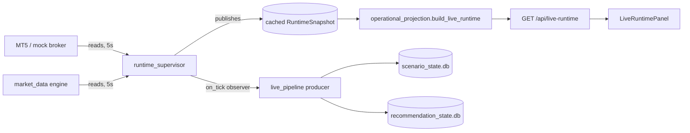
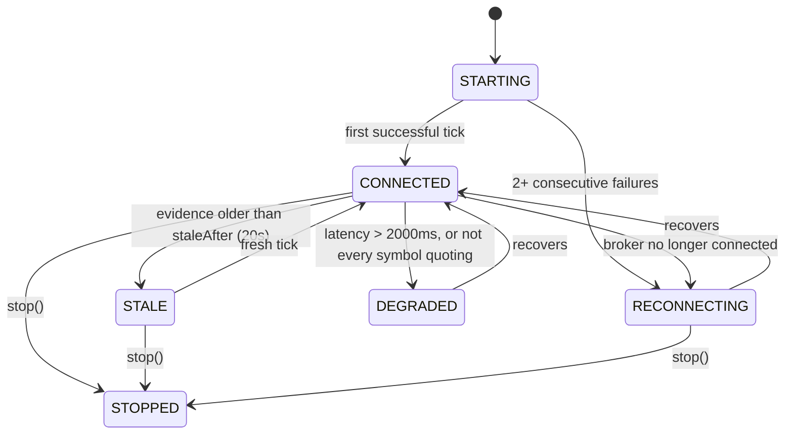

# LIVE-5A — First Live Trade: Smoke Workflow & Runtime Reference

The canonical acceptance procedure for the complete production pipeline, plus the
runtime ownership rules that make it work.

---

## 0. Status — read this first

**The automated smoke test passes end-to-end against the MOCK broker.** It is
`backend/tests/test_live_runtime_5a.py::test_smoke_the_complete_pipeline_from_market_evidence_to_ledger`
and it drives every stage: market evidence → Scenario → Recommendation →
operator decision → Intent → Order → Position → close → Trade Ledger →
projection.

**The genuine live MT5 trade has NOT been executed, and cannot be from the
development host.** Verified, not assumed:

| Check | Result |
|---|---|
| `import MetaTrader5` | `ModuleNotFoundError` |
| Host platform | `Darwin arm64` — the MT5 wheel is Windows-only |
| `live/mt5_gateway.py:23` | `try:  # Windows VPS only; absent everywhere else by design` |
| `MT5_LOGIN` / `MT5_SERVER` / `NODE_ENDPOINT` | unset |
| Default broker | `mock` (`broker._ACTIVE == "mock"`) |

Section 5 is the runbook for performing the live trade on a Windows host. It is
deliberately a human procedure: it places a real order with real money, so it
requires an operator at the keyboard.

---

## 1. Runtime ownership (the rules that changed)

### Before LIVE-5A — audited, and the reason this slice exists

There was **no refresh owner**. Every `/api/operations/*` handler called
`server._projection_sources()`, whose `broker_snapshot` binding is
`_fresh_broker_snapshot()` — a synchronous broker read *on the request path*. The
browser polls fourteen queries (nine at 10s, plus 15s/20s/30s tiers), so the
broker was read fourteen times per cycle, each read with its own idea of "now",
and nothing could report when the broker was last actually heard from.

### After LIVE-5A



| Concern | Owner | Notes |
|---|---|---|
| Broker reads | `runtime_supervisor` | The only component polling on a cadence |
| Market reads | `market_runtime` (called by the supervisor) | Never polls itself |
| Projection | `operational_projection` | Single owner, unchanged rule |
| Cadence | `RUNTIME_TICK_SECONDS`, default **5s** | Single daemon thread |
| Scenario/Recommendation creation | `live_pipeline` as a tick **observer** | Runs outside the tick lock |
| API requests | Serve the **cached** snapshot | Read no broker |
| Browser | Consumes `/api/live-runtime` | Reads no broker, computes nothing |

**Non-overlap:** `tick_once()` holds a lock, so the loop and any manual tick
serialize. **Stale-loop detection:** ages are recomputed against `now` on every
read, so a wedged loop degrades to `STALE` instead of freezing on `CONNECTED`.

**Deliberately left alone:** the pre-existing per-request broker reads on the
legacy `/api/operations/*` routes. Removing them changes LIVE-4A behaviour, which
this slice does not need and must not risk. The *live* dashboard reads no broker;
that is what LIVE-5A guarantees.

---

## 2. Runtime health



Rules are **ordered** — the first match wins, so the same evidence always yields
the same state. `UNKNOWN` is reserved for "broker age cannot be determined".

---

## 3. Endpoints

| Route | Purpose |
|---|---|
| `GET /api/live-runtime` | **The one live-dashboard payload.** Runtime + broker + symbols + execution counts |
| `GET /api/live-runtime/health` | Health only; cheap to poll |
| `POST /api/live-runtime/tick` | Force one refresh. Read-only: cannot submit or modify an order |
| `GET /api/trade-recommendations/{id}/preflight` | Every pre-trade condition (PART 15) |

> Namespaced `/api/live-runtime/*`, **not** `/api/runtime/*` — a pre-existing
> `/api/runtime/health` (overlay/event-store liveness) would have been shadowed.

---

## 4. The smoke workflow (10 stages)

Each stage has an automated assertion in the acceptance test.

| # | Stage | Observable |
|---|---|---|
| 1 | Launch | `runtime.state` leaves `STARTING` |
| 2 | Broker connects | `broker.connected: true`, ping populated |
| 3 | Dashboard becomes live | symbols show bid/ask, `live: true`, `availability: ok` |
| 4 | Scenario appears | one Scenario per completed M15 break; `activeScenarios` increments |
| 5 | Recommendation appears | exactly one, `PROPOSED`, `decidable: true`, full terms |
| 6 | Operator accepts | `ACCEPTED`, `outcome: NOT_EXECUTED`, **no order placed** |
| 7 | Preflight clears | `clear: true`, `blockers: []` |
| 8 | Order + position appear | Intent carries `recommendationId`; position in the snapshot |
| 9 | Position closes | broker deals show `DEAL_ENTRY` in + out |
| 10 | Ledger records | closed trade with Scenario **and** Recommendation lineage |

Run it:

```bash
cd backend && python3 -m pytest tests/test_live_runtime_5a.py -q
```

---

## 5. Runbook — performing the genuine live trade

**Prerequisites (a Windows host; none are satisfiable on macOS):** MT5 terminal
installed and logged in, `pip install MetaTrader5`, and a **demo account first**.

```bash
# 1. Point the market-data layer at the real terminal.
set MARKET_DATA_PROVIDER=mt5
set MT5_LOGIN=<login>
set MT5_PASSWORD=<password>
set MT5_SERVER=<server>

# 2. Enable automatic Scenario/Recommendation production (OFF by default).
set LIVE_PRODUCER_ENABLED=1

# 3. Start the backend, then the frontend.
python -m uvicorn server:app --port 8000
```

Then, in order:

1. **Confirm the dashboard is genuinely live.** `GET /api/live-runtime` must show
   `broker.connected: true`, `broker.adapterKind: "mt5"`, and for your symbol
   `provenance: "mt5"` with `availability: "ok"`. If `provenance` is `fixture`,
   you are looking at derived numbers — stop and fix the provider.
2. **Wait for a Scenario.** One per completed M15 candle that closes beyond the
   previous candle's range. Nothing appears until a real break occurs.
3. **Review the Recommendation** in the Recommendation panel: entry, stop, target,
   quantity (`0.01`), risk (`0.25%`), planned R (`2.0`), expiry (45 min).
4. **Run preflight:** `GET /api/trade-recommendations/{id}/preflight`. Every check
   must pass. It will block until execution mode is `manual_live` and a valid
   authorization grant exists — that is intended.
5. **Accept** through the LIVE-4E decision surface. This records a decision and
   **submits nothing**.
6. **Submit the order** via the existing `POST /api/execution/market-order`,
   passing `recommendationId` so lineage is captured, with an `Idempotency-Key`.
   All LIVE-2/LIVE-3 safety, authorization and mode gates apply unchanged.
7. **Watch the position** in the dashboard; close it from the existing position
   controls (or let stop/target resolve it).
8. **Confirm the ledger** records the closed trade with both Scenario and
   Recommendation lineage.

**Recommended first run:** demo account, `0.01` lots, one symbol, during liquid
hours.

---

## 6. Explicit non-goals

LIVE-5A **proves the production pipeline**. It is **not** a production strategy
and **not** an optimisation milestone.

- The candle-break rule is a **pipeline proof with no edge**. It was never
  backtested, tuned or selected. Do not trade it for its signal.
- No analytics, no win rate, no expectancy, no equity curve.
- No autonomous execution. Acceptance records a decision; a human submits the
  order.
- The producer is **OFF by default** (`LIVE_PRODUCER_ENABLED`).
- No new execution capability: the command surface is still exactly
  `SubmitMarketOrder`, `ModifyPositionProtection`, `CancelPendingOrder`,
  `ClosePosition`.

---

## 7. Known limitations

1. **The genuine live trade is unperformed** (§0). Everything upstream of the
   broker write is proven; the broker write itself is proven only against the
   mock adapter.
2. **Legacy `/api/operations/*` routes still read the broker per request.** Only
   the live surface is cached.
3. **The MT5 provider's `quote()` remains fixture-derived** ("PREVIEW ONLY" in
   its own docstring). LIVE-5A added `live_tick()` for a genuine
   `symbol_info_tick` read and the runtime prefers it, falling back to the
   derived quote with `detail` saying so — but a caller of `quote()` still gets
   a preview.
4. **Recommendation → Intent linkage is opt-in.** The submitter must pass
   `recommendationId`; nothing forces it.
5. **Ledger ingestion is not automatic on close.** `refresh_trade_ledger` is an
   internal service, not wired to the runtime loop; the reconstruction path is
   proven, the trigger is manual.
6. **One timeframe, one rule.** M15 only, and `previousHigh`/`previousLow` only.
7. **Operator identity is asserted, not authenticated** (inherited from LIVE-4E).
