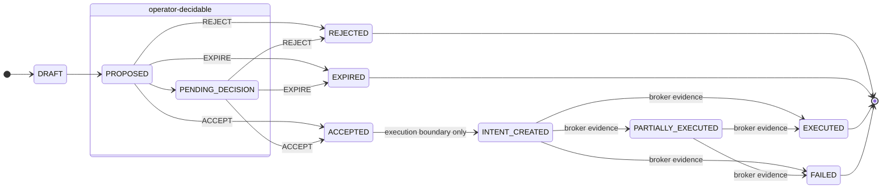
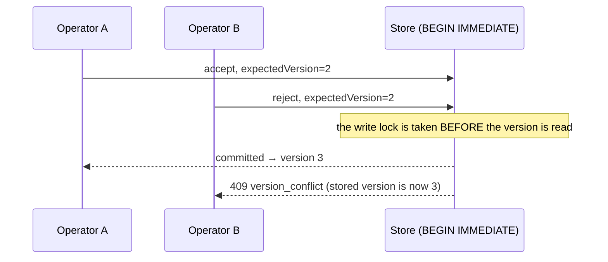

# Recommendation Decision API & State Machine (LIVE-4E)

The canonical reference for the operator decision surface: the write API, the
state machine it may drive, and the guarantees it does and does not give.

> **Accepting a Recommendation records an operator decision only. It does not
> submit, modify, or execute any trade.**
>
> This is not a disclaimer — it is the enforced property. No route in this
> document can reach the broker, the execution pipeline, the authorization plane
> or the ledger, and no operator decision can move a proposal into a state that
> asserts a trade happened.

---

## 1. Two state machines, not one

The Recommendation domain has a **full lifecycle** and a strictly smaller
**operator lifecycle**. Only the second is reachable through the API.



**Solid rules:**

| Property | Value |
|---|---|
| Decidable statuses | `PROPOSED`, `PENDING_DECISION` |
| Operator decision types | `ACCEPT`, `REJECT`, `EXPIRE` |
| Statuses an operator can produce | `ACCEPTED`, `REJECTED`, `EXPIRED` |
| Statuses an operator can **never** produce | `INTENT_CREATED`, `PARTIALLY_EXECUTED`, `EXECUTED`, `FAILED` |
| Not on the operator surface | `DEFER`, `WITHDRAW`, `SUPERSEDE`, `AUTO_ACCEPT`, `AUTO_REJECT`, `SYSTEM_INVALIDATE` |

`ACCEPTED → INTENT_CREATED` is a legal *domain* transition but not an *operator*
one: only the execution boundary may record that an intent exists, because only
it knows one does. If accepting advanced the status, an accepted-but-never-
submitted proposal would claim an intent that was never created.

`SUPERSEDE` and `WITHDRAW` are omitted deliberately — supersession requires
constructing a replacement proposal, which is a creation surface this slice does
not expose.

### Why a proposal is closed

`undecidableReason` is returned on every read and rendered verbatim by the UI, so
a disabled control always states its own reason:

| Reason | Meaning |
|---|---|
| `not_yet_proposed` | Still `DRAFT`; not yet put forward. |
| `already_accepted` | A decision was already recorded. |
| `already_terminal:<STATUS>` | Closed. Decisions are final. |
| `execution_in_progress:<STATUS>` | Execution began; it is no longer a proposal. |

---

## 2. The write API

Base path `/api/trade-recommendations`. **Three routes. No `DELETE`, no `PUT`, no
`PATCH`, no create.**

```
POST /api/trade-recommendations/{recommendation_id}/accept
POST /api/trade-recommendations/{recommendation_id}/reject
POST /api/trade-recommendations/{recommendation_id}/expire
```

### Request

```http
POST /api/trade-recommendations/rcm_0fef9df631d4c0fd/accept
X-Operator-Id: op_jane            # REQUIRED — anonymous mutation is refused
X-Correlation-Id: req_abc123      # optional, threaded onto the decision
Idempotency-Key: dec-attempt-1    # optional but recommended
Authorization: Bearer <token>     # when the global auth boundary is enabled
Content-Type: application/json

{
  "reason": "conditions met",     # REQUIRED, non-empty
  "note": "clean BOS retest",     # optional, ≤ 1000 chars
  "expectedVersion": 2            # optional optimistic-concurrency precondition
}
```

### Success — `200`

```json
{
  "recorded": true,
  "replayed": false,
  "recommendationId": "rcm_0fef9df631d4c0fd",
  "status": "ACCEPTED",
  "version": 3,
  "outcome": "NOT_EXECUTED",
  "executed": false,
  "notice": "This records an operator decision only. No order was submitted, modified or executed.",
  "decision": {
    "decisionType": "ACCEPT",
    "actor": "actor_cb2130fd6153",
    "identityAssurance": "asserted",
    "againstVersion": 2,
    "sequence": 3,
    "reason": "conditions met",
    "note": "clean BOS retest"
  }
}
```

`outcome` is `NOT_EXECUTED` after an accept, and `executed` is `false` on every
response this API can produce.

### Refusals

| Status | Code | Meaning |
|---|---|---|
| `403` | `operator_identity_required` | No operator asserted. Nothing was recorded. |
| `403` | `operator_identity_invalid` | Malformed id (3–64 chars of `[A-Za-z0-9_.:@-]`). |
| `403` | `operator_identity_looks_secret` | The id resembled credential material. |
| `403` | `actor_type_not_permitted` | Only `OPERATOR` may take operator decisions. |
| `403` | `decision_type_not_permitted` | Not one of accept / reject / expire. |
| `404` | `recommendation_not_found` | Unknown recommendation. |
| `409` | `version_conflict` | Another operator decided first. |
| `409` | `decision_sequence_conflict` | A concurrent decision won this ordinal. |
| `409` | `idempotency_key_reused` | That key already recorded a *different* decision. |
| `422` | `reason_required` | A decision must record why it was taken. |
| `422` | `not_decidable` | `detail` carries the `undecidableReason`. |
| `422` | `invalid_expected_version` | `expectedVersion` was not an integer. |
| `503` | `recommendation_store_unavailable` | The durable store could not be read. |

Every `409` carries the current truth so the caller can retry against it:

```json
{ "error": "conflict", "code": "version_conflict", "executed": false,
  "currentStatus": "REJECTED", "currentVersion": 3 }
```

### Reads

| Route | Returns |
|---|---|
| `GET /api/trade-recommendations` | List + summary, filtered and paginated. |
| `GET /api/trade-recommendations/summary` | Counts only — never performance analytics. |
| `GET /api/trade-recommendations/active` | Active proposals. |
| `GET /api/trade-recommendations/{id}` | Detail incl. `version`, `decidable`, `undecidableReason`, decisions, history. |
| `GET /api/trade-recommendations/{id}/history` | Append-only lifecycle events. |
| `GET /api/trade-recommendations/{id}/decisions` | Append-only decisions + visible conflicts. |

> `/api/recommendations` (no `trade-` prefix) is a **different, pre-existing**
> surface serving the fixture world's POLICY-CHANGE proposals. It is untouched.

---

## 3. Optimistic concurrency

`version` is the sequence of the last applied event. It is *derived* from the
append-only log, never assigned independently, so it cannot drift from history.



Guarantees, all regression-pinned:

* exactly one of two racing decisions commits;
* the loser receives a conflict and is **never told it succeeded**;
* the resulting state is valid and matches the winner;
* history stays complete — one decision, one event, contiguous sequences.

Omitting `expectedVersion` is allowed: concurrency control is opt-in for callers
with no prior read to protect.

**Idempotency** is resolved *before* any state precondition. A retry after a
successful commit replays the original decision; checking state first would tell
a caller its own successful decision was illegal, because by then the proposal is
terminal.

---

## 4. Identity and authorization — read this before trusting `actor`

This system has **no per-operator authentication**. The audit is recorded here
because the API's honesty depends on it:

* `auth_policy` is a **single shared bearer token**, and says so itself: *"NOT
  identity. There are no users, roles or sessions."* It is **disabled by
  default**.
* `server._operator_id()` returns the first operator in the fixture world, or the
  literal `"system"`. It is a display value.

So every decision records how much its identity claim is actually worth:

| `identityAssurance` | Meaning |
|---|---|
| `authenticated` | The API boundary was enforcing **and** an operator id was asserted. |
| `asserted` | An operator id was asserted; the boundary was not authenticating it. |
| `unknown` | Recorded by an internal path that stated no assurance. |

**A caller could assert any operator id when the boundary is off.** That is a
real limitation, not a theoretical one — which is exactly why the assurance level
is stored on the decision and shown in the UI, instead of letting a reader assume
the actor was verified.

What the gate *does* enforce, always:

* an explicit operator identity — **anonymous mutation is refused regardless of
  whether the global auth gate is enabled**;
* identity shape, with credential-looking ids rejected outright;
* actor type `OPERATOR` only;
* the three operator decision types only.

The raw operator id never reaches a read view: it is pseudonymized to
`actor_<12 hex>` in every projection, API response and log line.

**Deciding is not executing.** This gate grants no execution right;
`command_authorization` remains the sole authority for that and is untouched.

---

## 5. Audit record

Every decision appends one immutable event. Nothing is ever overwritten: the
tables have no update or delete surface, and a contradictory write at an occupied
ordinal is a conflict.

| Field | Notes |
|---|---|
| `decisionId` / `sequence` | Deterministic; sequence is the event ordinal. |
| `recommendationId` | The proposal decided. |
| previous → new status | Recorded on the event payload. |
| `actor` | Pseudonym only. |
| `identityAssurance` | See §4. |
| `occurredAt` | Server-stamped. |
| `reason` | Required. |
| `note` | Optional, ≤ 1000 chars. |
| `againstVersion` | The version the operator had actually read. |
| `correlationId` | From `X-Correlation-Id`, when supplied. |
| `executionMode` | The mode the system was in when the decision was taken. |

A decision, its event and the snapshot commit in **one transaction**. Each
decision is also mirrored into the system-wide journal as
`RECOMMENDATION_{ACCEPT,REJECT,EXPIRE}`; a journal failure never loses a
committed decision.

---

## 6. Limitations and future work

* Operator identity is **asserted, not authenticated** (§4).
* Decision authorization is **structural** (actor type + decision type), not
  per-user — there are no roles to check against.
* An accepted proposal has **no path to an Intent**. Linkage remains opt-in at
  submission time, so `Recommendation → Intent` is still only populated when a
  caller passes `recommendationId`.
* `SUPERSEDE` and `WITHDRAW` are unreachable from the API; supersession needs a
  creation surface that does not exist yet.
* The trade/ledger lineage link is shown as *not yet available*: the read model
  does not yet carry a resolved trade for a recommendation.
