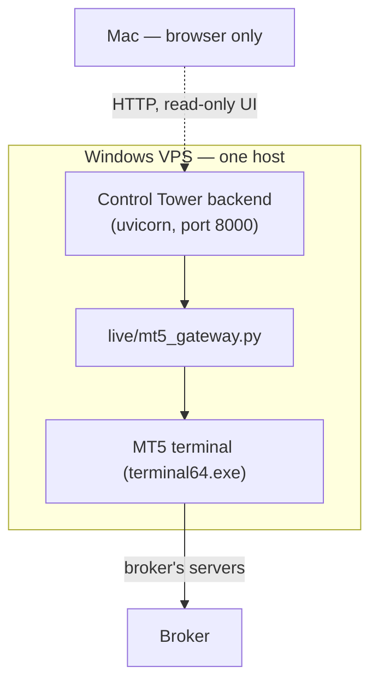

# Windows VPS Setup — MT5 Integration (LIVE-5B)

Everything needed to make the Control Tower capable of a real trade, and the
audited reason each step exists.

---

## 1. Topology — and one correction to the obvious assumption

The intuitive topology is *Mac → Backend → Windows VPS → MT5*. **That is not
what this repository supports.** `connection_policy` approves exactly one
profile, `local_loopback`, meaning **the backend must run on the same host as the
MT5 terminal**:



Verified: `evaluate_local_broker("mt5")` returns `allowed=True` only for
`local_loopback`. `remote_pre_live` and `remote_live` both deny with
`profile_not_approved` and four named prerequisites (`tls_trust_configured`,
`private_network_attested`, `secrets_management`,
`remote_activation_attested`). **Do not set `CONTROL_TOWER_CONNECTION_PROFILE`
to a remote value** expecting it to work — it fails closed by design.

The Mac's role is to open a browser at the VPS backend. It never contacts MT5.

---

## 2. Deployment checklist

Work top to bottom. `python3 -m integration_smoke` and
`GET /api/integration/diagnostics` verify each block.

### 2.1 Host
- [ ] Windows Server 2019+ / Windows 10+, **64-bit** (the MT5 wheel is 64-bit)
- [ ] RDP access
- [ ] Clock synced to UTC — every timestamp crossing the runtime is ISO-8601 UTC,
      and a skewed clock makes fresh data look stale

### 2.2 MT5 terminal
- [ ] MT5 installed; note the path to `terminal64.exe`
- [ ] Logged into the **demo** account manually, at least once
- [ ] Terminal **left running** — the Python API attaches to a running terminal
- [ ] *Tools → Options → Expert Advisors → Allow algorithmic trading* enabled
- [ ] Trading symbol present in **Market Watch** (note the exact name; brokers
      suffix them, e.g. `EURUSD.r`)
- [ ] History downloaded for M15 on that symbol

### 2.3 Python
- [ ] Python 3.11+ 64-bit (`python -c "import struct; print(struct.calcsize('P')*8)"` → `64`)
- [ ] `pip install MetaTrader5`
- [ ] `python -c "import MetaTrader5 as m; print(m.__version__)"` succeeds **in
      the same interpreter that will run the backend**
- [ ] Backend requirements installed

### 2.4 Environment (all switching is env-only; no code change)
```bat
set CONTROL_TOWER_BROKER_ADAPTER=mt5
set MARKET_DATA_PROVIDER=mt5
set MT5_PATH=C:\Program Files\MetaTrader 5\terminal64.exe
set MT5_LOGIN=<demo login>
set MT5_PASSWORD=<demo password>
set MT5_SERVER=<demo server>
set LIVE_MODE=dry_run
set LIVE_PRODUCER_ENABLED=0
```
- [ ] `CONTROL_TOWER_CONNECTION_PROFILE` **unset** (defaults to the approved
      `local_loopback`)
- [ ] Credentials supplied via the environment or a secret store — **never
      committed**

### 2.5 Network / firewall
- [ ] **Outbound** to the broker's MT5 servers (the terminal handles this; the
      backend never speaks the broker protocol)
- [ ] Port **8000 inbound** only from your own IP, if you browse from the Mac.
      Prefer an RDP/SSH tunnel over exposing it
- [ ] No inbound port is needed for MT5 itself
- [ ] If you expose the API beyond loopback, enable auth:
      `CONTROL_TOWER_AUTH_ENABLED=1` + `CONTROL_TOWER_API_TOKEN` (≥32 chars).
      Authentication is **off by default** and is not encryption — a bearer
      token over plain HTTP is readable on the wire

### 2.6 Verify before trading
- [ ] `GET /api/integration/diagnostics` → `ready: true`
- [ ] `GET /api/live-runtime` → `broker.connected: true`,
      `broker.adapterKind: "mt5"`, `broker.accountType: "demo"`
- [ ] Symbol shows `provenance: "mt5"` and `availability: "ok"`. If provenance is
      `fixture`, the price is **derived, not a broker tick**
- [ ] `python3 -m integration_smoke` → stages 1–3 PASS

---

## 3. MOCK → DEMO → LIVE

Environment only. No code change, no rebuild.

| | MOCK | DEMO | LIVE |
|---|---|---|---|
| `CONTROL_TOWER_BROKER_ADAPTER` | `mock` (default) | `mt5` | `mt5` |
| `MARKET_DATA_PROVIDER` | `fixture` (default) | `mt5` | `mt5` |
| MT5 account | none | **demo** | real |
| `LIVE_MODE` | `dry_run` | `dry_run` → `live` | `live` |
| CT execution mode | `observe` | `manual_live` when trading | `manual_live` |

`LIVE_MODE` (gateway) and the Control Tower execution mode are **different
gates** and both apply. The execution mode is deliberately **not** settable by
env var — it moves only through `POST /api/execution/mode` with the manual-live
gates satisfied.

**Before LIVE:** run at least one full demo trade through all twelve smoke
stages, confirm `accountType: "demo"` was showing, then re-read
[FIRST_LIVE_TRADE_RUNBOOK.md](FIRST_LIVE_TRADE_RUNBOOK.md) §6.

---

## 4. What is NOT provided

- No installer or provisioning script. These are manual steps on purpose: each
  one is a decision an operator should make consciously.
- No remote broker access (§1).
- No credential storage. The backend reads `MT5_PASSWORD` from the environment
  and never logs, echoes or persists it.
